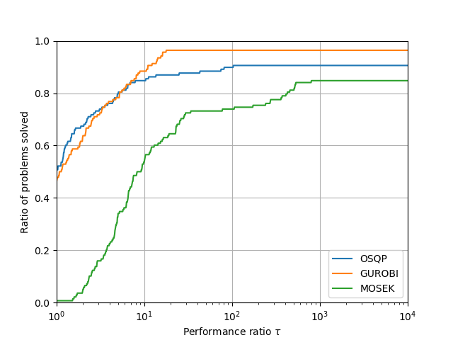

# Benchmark examples for the OSQP solver

These are the scripts to compare the following Quadratic Program (QP) solvers

-   OSQP
-   GUROBI
-   MOSEK
-   ECOS (through CVXPY)
-   qpOASES

The detailed description of these tests is available in [this paper](https://arxiv.org/pdf/1711.08013.pdf).
To run these scripts you need `pandas` and `cvxpy` installed.

## Benchmark problems
The problems are all randomly generated as described in the OSQP paper.
They produce a benchmark library of `1400` problems with nonzeros ranging from `100` to `10'000'000`.
Problem instances include

-   Random QP
-   Equality constrained QP
-   Portfolio
-   Lasso
-   Huber fitting
-   Constrained optimal control

We generate the problems using the scripts in the `problem_classes` folder.

To execute these tests run
```python
python run_benchmark_problems.py
```

### Results
The resulting [performance profiles](https://link.springer.com/article/10.1007/s101070100263) are


## Maros Meszaros problems
These are the 138 hard problems from the hard [Maros Meszaros testset](http://www.cuter.rl.ac.uk/Problems/marmes.shtml) converted from [this repository](https://github.com/YimingYAN/QP-Test-Problems).
In these benchmarks we compare OSQP with GUROBI and MOSEK.

To execute these tests run
```python
python run_maros_meszaros_problems.py
```

### Results
The resulting [performance profiles](https://link.springer.com/article/10.1007/s101070100263) are


## Parametric problems
These tests apply only to the OSQP solver with and without warm-starting for three parametric examples of
-   Portfolio
-   Lasso
-   Constrained optimal control (MPC)

The problem construction is the same as for the same categories in the **Benchmark Problems**.

To execute these tests run
```python
python run_parametric_problems.py
```
